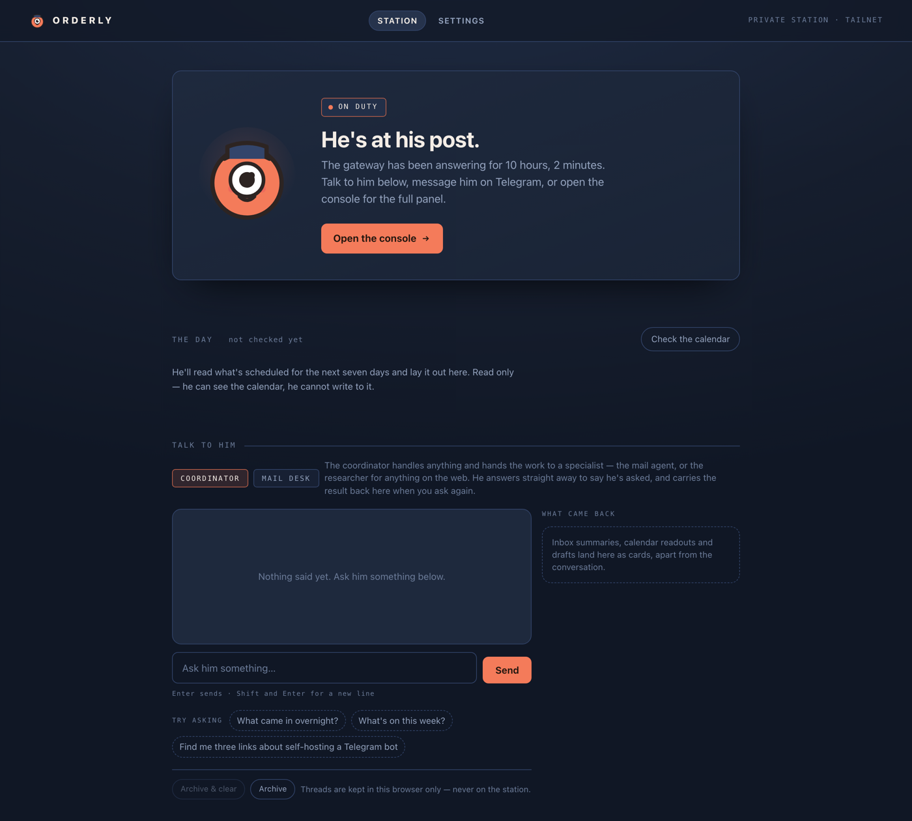

  

<h1 align="center">ORDERLY</h1>

ORDERLY is a self-hosted private AI agent station for one operator who is willing to run an always-on Linux box. It handles email, calendar, reminders, scheduling, research, and delegated work through chat and a small web front door. The closest commercial analogue is xAI's Grok Bot, now bundled with mainstream Cursor plans at about $60 per month; ORDERLY is that class of assistant self-hosted: your hardware, your data, strict identity separation, no subscription fee. You choose the model provider and own the box, credentials, operating failures, and trust model.

  

## What it does today

- Routes chat to a coordinator and specialist agents. Telegram is the verified primary channel; Discord is a documented DMs-only alternative for the same single named operator.
- Provides a zero-dependency web front door with live gateway status, chat at two desks, a seven-day agenda, reminders, an approval queue, and guarded model settings. Browser threads stay in the browser and can be archived, restored, or deleted.
- Reads two separate mailboxes and calendars under the same limited scopes. Results keep their account labels instead of merging identities.
- Triages mail, runs operator-written mail routines, and creates drafts in the relevant account. Drafts wait for review; approving one records that it was read and kept, but never sends it. The operator sends from the mail client.
- Proposes calendar creates and updates. A separate host-side credential performs the write only after approval. There is no calendar-delete path, and failed writes remain pending.
- Keeps coordinator-owned reminders and tasks, delivers owner-gated timed reminders, and sends a daily briefing with inbox, calendar, and due items. If one part fails, the briefing identifies the missing part and sends the rest.
- Researches the web through the gateway's guarded fetch and returns current links without giving the researcher's container network access.
- Gives only the coordinator persistent memory. The mail and research agents remain memoryless. A voice profile can be built from sent mail, reviewed by the operator, and installed separately as an immutable drafting rule.
- Includes an orchestrator desk that turns a request into a bounded coding brief, dispatches it to an external agent lane, watches terminal state, and reports the result. ORDERLY does not edit, commit, merge, or verify that code for the operator.
- Keeps reply style as station-owned prompt data: ten plain-language presets, optional per-agent refinements, and no route from the text to tools, credentials, approvals, or memory.
- Provides a per-agent connector framework with a compiled catalog, one account per instance, reviewed operation attachments, fixed HTTP-over-Unix-socket calls, probe-gated activation, and route-first suspend/resume/detach. Catalog entries alone install nothing, and no provider adapter ships as active by implication.

## Security posture

ORDERLY assumes email and web pages will eventually contain hostile instructions. OpenClaw does not provide content-level prompt-injection mitigation, so ORDERLY limits blast radius instead of claiming hostile text can be made safe.

- The gateway and front door bind to loopback. Tailscale Serve publishes them only on the operator's tailnet, with an SSH tunnel as fallback. The setup does not use Tailscale Funnel or expose a public endpoint.
- The bot answers one allowlisted operator. Scheduling belongs to one named identity on one chat channel; the front door holds a gateway bearer but is not that identity by design and cannot create scheduled jobs.
- Each agent runs in its own container with a read-only root filesystem, no privileges, and no network by default. Only the mail agent has provider egress. The coordinator alone gets a writable mount, limited to its own workspace, so its notes persist.
- Credentials are split by connector and capability rather than exposing a keyring. The agent-visible mail store holds mail read, draft creation, and calendar read access. Calendar write uses a different store that no agent container mounts and a host-side path invoked only after operator approval.
- The mail path has an explicit limit. Normal commands refuse sending and the installed accounts have no separate send scope, but the CLI default can be overridden and the provider's draft permission is documented as also covering send. Draft-only authority is therefore not a complete structural wall; the last defense is still the model following its standing orders. The front door itself has no credential that can send.
- The researcher and coordinator have no container egress. Research runs through guarded fetch outside the sandbox, and fetched text is treated as data, not instructions. The full browser tool remains denied.
- The browser never receives the gateway token or any provider credential value. The front door adds the bearer host-side for loopback requests. Settings writes are restricted to model choices and tags by typed input, changed-path allowlists, protected-subtree comparisons, same-origin checks, confirmation, and atomic file replacement.
- Reply-style saves use a separate mode-0600 sidecar and the same typed, allowlisted, atomic discipline. Agents receive only a quoted lower-precedence block assembled on the host and cannot read or write its source record.
- A connector instance names one provider account, service identity, credential store, socket, and endpoint allowlist. Attachment confirmation binds the agent, operations, account label, endpoints, and probe revision into one digest. Lifecycle changes cross a fixed host controller that changes the derived route and obtains its own probes; the browser cannot submit paths or results. Agent sockets expose only read, propose, and local operations; generic apply calls remain refused until a connector-specific approval adapter supplies a persistent replay guard.
- Standing orders are immutable in the coordinator workspace. The agents that routinely read hostile content have read-only mounts, no writable memory, and no mounted configured workspace. The gateway's unconfined host terminal tool remains disabled.

## Install

You need an always-on Linux host, a current Node.js runtime, Docker or Podman for agent sandboxes, [OpenClaw](https://github.com/openclaw/openclaw), one supported chat channel, Tailscale, and a model-provider credential. Start with [`web/deploy/install.sh`](web/deploy/install.sh) and the public [`docs/`](docs/). Any model provider supported by OpenClaw can be selected in configuration.

The public repository contains the broker, front door, interface and feature specifications, and tests. Deployment configuration, standing orders, security review records, and other installation-specific material belong in a private sibling repository because they describe and expose one particular station.

## Scope

ORDERLY is single-operator and self-hosted by design. It is not multi-tenant SaaS, and it is not a development tool. Adding authority takes an explicit decision: mail push would require a public endpoint, issue automation would grant write access, sending mail remains deferred, and pairing to real machines is limited to a possible sacrificial VM.

Built on [OpenClaw](https://github.com/openclaw/openclaw), the MIT-licensed gateway that provides channels, sandboxing, and provider abstraction. ORDERLY is released under the [MIT license](LICENSE).
